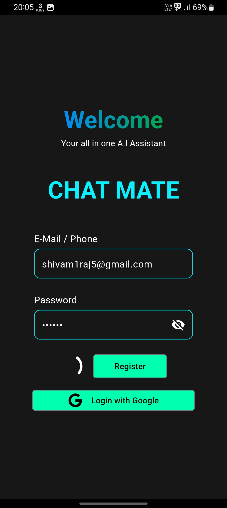
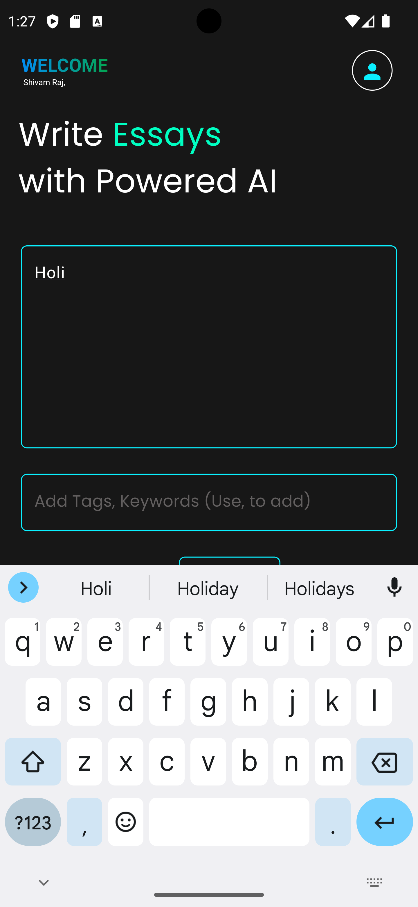

# ai_driven_assignment_application_flutter

# • AI Based Assignment Generator Application 

Flutter, Dart, ChatGPT API  

• An AI-driven app has been developed to seamlessly assist users in effortlessly generating high-quality content. 
• Smart algorithms ensure coherence and relevance in the generated assignment. 

## 📷 Previews

## Getting Started

This project is a starting point for a Flutter application.

A few resources to get you started if this is your first Flutter project:

For help getting started with Flutter development, view the
[online documentation](https://docs.flutter.dev/), which offers tutorials,
samples, guidance on mobile development, and a full API reference.

